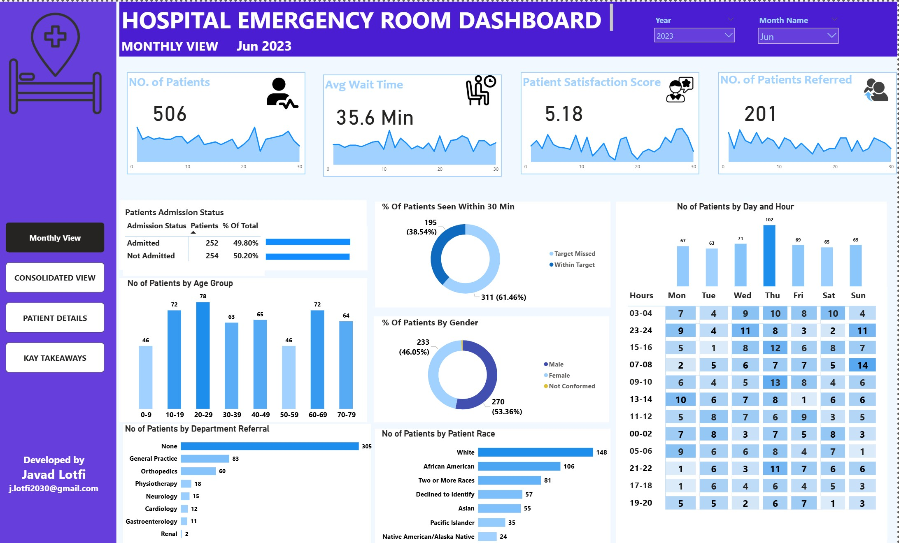

# 🏥 Hospital Emergency Room Dashboard (Power BI)

A comprehensive Power BI dashboard designed to monitor and analyze the performance of a hospital's Emergency Room (ER), focusing on operational efficiency, patient demographics, and service quality.

---

## 📊 **Dashboard Overview**

This dashboard provides a consolidated view of key performance indicators (KPIs) such as:

- **Total Number of Patients:** 3334
- **Average Wait Time:** 35 minutes
- **Patient Satisfaction Score:** 5.03 / 10
- **Number of Referred Patients:** 1372
- **Admission Status:** Admitted vs Not Admitted
- **Patients Seen Within 30 Minutes**
- **Demographics:**
  - Age Groups
  - Gender Distribution
  - Patient Race
- **Department Referrals**
- **Patients by Day & Hour of Visit**

---

## 📌 **Key KPIs**

| KPI                             | Description                                      |
|----------------------------------|--------------------------------------------------|
| 🧍‍♂️ No. of Patients             | Total ER visits during selected timeframe       |
| ⏱ Avg Wait Time                 | Average wait time from arrival to first contact |
| 😊 Satisfaction Score           | Average feedback score from patients            |
| 🔁 Referral Count               | Patients referred to other departments          |
| 🕒 Seen Within 30 Min (%)       | Efficiency indicator for ER triage process      |
| 📅 Temporal Distribution        | Peak days/hours of ER utilization               |
| 👨‍⚕️ Department Referrals        | Workload of downstream departments               |
| 👥 Demographic Breakdown        | Age – Gender – Race analysis                    |

---

## 📁 **Files**

| File Name              | Description                                    |
|------------------------|------------------------------------------------|
| `er_dashboard.pbix`    | Power BI project file                          |
| `dashboard_sample.jpg`| Sample screenshot of the dashboard             |
| `README.md`           | Project documentation (this file)              |

---

## 🖼 **Dashboard Snapshot**

---

## 🚀 **How to Use**

1. Download the `.pbix` file.
2. Open it in **Power BI Desktop**.
3. Connect your own ER dataset (if available).
4. Refresh visuals to generate an updated analytics view.

---

## 🔧 **Technologies Used**

- **Power BI Desktop (May 2024 version)**
- Data Modeling (Star Schema)
- DAX Measures
- Custom Visualizations
- UX/UI Design Best Practices

---

## 📬 **Author**

Developed by **Javad Lotfi**  
📧 j.lotfi2030@gmail.com  

---

> 🔄 *Future improvements can include predictive analytics (e.g. forecasting patient volume), integration with real-time hospital data, and drill-through patient-level details.*

